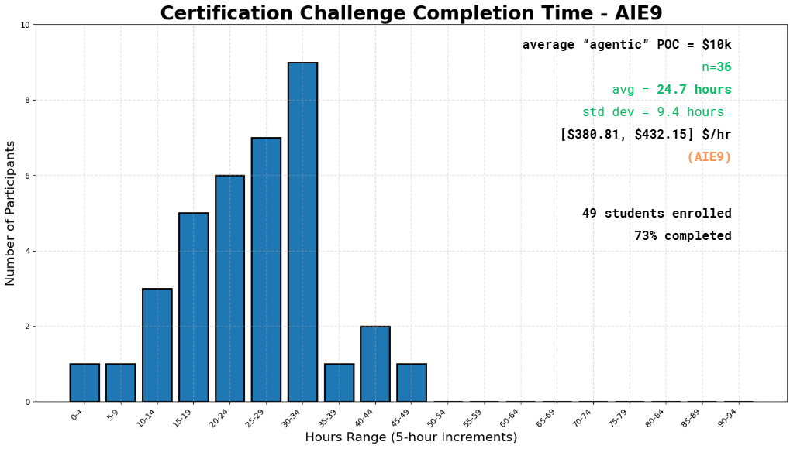

# The Certification Challenge v1.0

# Overview

Welcome to the middle of the course! We’re 5 weeks in, and we’ve covered a lot of ground - you all certainly have enough prototyping skill to be dangerous!

At this point, it’s important to consider everything in front of us as a blank page - blue sky!

It’s time to align the general skills we’ve learned (and will continue to learn!) in the specific direction aligned with what you’re aiming at.

What are your goals for the rest of 2026?

How can you build 🏗️, ship 🚢, and share 🚀 your way towards achieving them?

It all starts now, with the Certification Challenge, which is the next step towards continuing your journey to Demo Day!

The Certification Challenge is due Tuesday July 14th.

> 💡 **Remember:** *You know enough already to be dangerous*. You already know enough of the concepts and code you need to build, ship, and share production AI applications!

And this is what the Certification challenge is all about - putting **your skills to the test**!

# Setting Expectations

During our last cohort, here is how the numbers shook out. It took an average of 24.7 hours for people to complete the challenge.

It’s very much worth considering that the kind of AI Engineering work we’re doing; that is, scoping a problem, creating a solution to that problem that solves a specific pain point for real customers or stakeholders, and engineering it for scale from day 1, is extremely valuable work.

In our opinion, **this is the kind of pilot project work that you should be charging $5–20k as a solo consultant**.

It is also the kind of work that, after you take a few shots on goal, will become faster and faster for you to knock out.

Finally, it’s worth noting that Certified AI Engineers not only are at the top of hiring lists within our network, but we’ve worked with multiple former students & solo consultants in the past to fill up their plate with project work, and we’ve helped certified students running startups to build out their teams.

What is in your future as an AI Engineer or AI Engineering Leader?

# Your Project Idea

1. What **problem** are you trying to solve? *Why is this a problem?*
2. What is your proposed **solution**? *Why is this the best solution?*
3. Who is the **audience** that has this problem and would use your solution? *Do they nod their head up and down when you talk to them about it?*

Problem, Solution, Audience.

That’s really all you need.

We might call this *AI Product Management*. This work asks "**what** should I build and why?"

From there, we need to do some *AI Engineering*. This work asks "**how** should I build, evaluate, and improve?"

The best AI engineers can do both.

Once you know the problem to be solved, you must be capable of guiding your team towards implementation.

# Task 1: Defining Problem, Audience, and Scope

**You are an AI Solutions Engineer.**

**What** problem do you want to solve? **Who** is it a problem for?

> 📝 **Task 1:** Articulate the problem and the user of your application
>
> **Hints**
> - First read *Concrete Startup Idea* from the AI Fund.
> - What is the user’s job title, and what is the part of their job function that you’re trying to automate?

## ✅ Deliverables

1. Write a succinct 1-sentence description of the problem. Do not mention or imply a solution.
2. Write 1–2 paragraphs covering:
   a. Who has the problem?
   b. What are they trying to do?
   c. How do they handle it today?
   d. Why isn't that good enough?
3. Create a workflow diagram illustrating the current workflow.
   a. The Sequence of steps the user takes
   b. The tools, systems, or documents they interact with
   c. The points where the workflow is slow, repetitvem or error-prone
4. Create a list of evaluation questions or input-output pairs.

# Task 2: Propose a Solution

> 📝 **Task 2:** Articulate your proposed solution
>
> **Hint**
> - Recall the LLM Application Stack.
> - What architectural decisions and tradeoffs are required?

## ✅ Deliverables

1. Describe your solution in one sentence.
2. Create an infrastructure diagram including:
   1. LLM(s)
   2. Agent orchestration framework
   3. Tool(s)
   4. Embedding model
   5. Vector database
   6. Monitoring tool
   7. Evaluation framework
   8. User interface
   9. Deployment tool
   10. Any additional components
3. Create an Agent Workflow Diagram with a 1–2 paragraph explanation.

Requirements:
- Use an LLM gateway.
- Include a memory component.
- Run in a browser on both phone and laptop.

# Task 3: Dealing with the Data

**You are an AI Systems Engineer.**

> 📝 **Task 3:** Collect your own data (RAG) and choose at least one external API.

## ✅ Deliverables

1. Describe your chunking strategy.
2. Describe your data source, external API, and how they interact.

# Task 4: Building an End-to-End Agentic RAG Prototype

> 📝 Build an end-to-end Agentic RAG application using a production-grade stack.

## ✅ Deliverables

1. Build the prototype.
2. Deploy it to a public endpoint (e.g. Vercel, Render, FastAPI Cloud).

# Task 5: Evals

**You are an AI Evaluation & Performance Engineer.**

## ✅ Deliverables

1. Prepare a test dataset.
2. Create an evaluation harness.
3. Summarize conclusions about performance.

# Task 6: Improving Your Prototype

**You are an AI Systems Engineer.**

## ✅ Deliverables

1. Implement an advanced retrieval technique and explain why.
2. Compare performance against the original in a table.
3. Improve another component and demonstrate better results using your evaluation harness.

# Task 7: Next Steps

Reflect on what you plan to keep for Demo Day and what you would improve.

# Final Submission

Include:

1. A public GitHub repository containing:
   1. A Loom video (10 minutes or less).
   2. A written document addressing every deliverable.
   3. All relevant code.

Questions? Email `jacob@aimakerspace.io`
